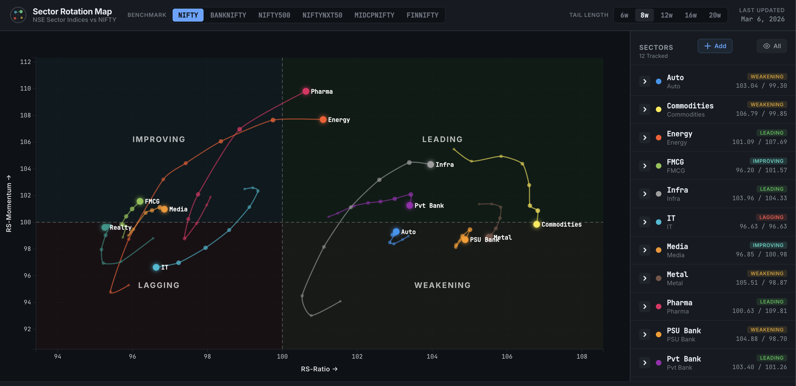

# Sector Rotation Map

An interactive Relative Rotation Graph (RRG) dashboard for NSE sector indices, powered by [OpenAlgo](https://openalgo.in).

Inspired by [@traderprad's tweet](https://x.com/traderprad/status/2029818798472053237/photo/1) on sector rotation analysis for the Indian market.



## What is an RRG?

A Relative Rotation Graph plots securities on a four-quadrant chart based on their relative strength (RS-Ratio) and momentum (RS-Momentum) against a benchmark index. Securities rotate through four quadrants:

- **Leading** (top-right) — Strong relative strength, strong momentum
- **Weakening** (bottom-right) — Strong relative strength, fading momentum
- **Lagging** (bottom-left) — Weak relative strength, weak momentum
- **Improving** (top-left) — Weak relative strength, gaining momentum

The tail trail shows the historical path of each sector, revealing rotation patterns and trend direction.

## Sectors Tracked

| Symbol | Sector |
|--------|--------|
| NIFTYIT | IT |
| NIFTYAUTO | Auto |
| NIFTYPHARMA | Pharma |
| NIFTYENERGY | Energy |
| NIFTYFMCG | FMCG |
| NIFTYMETAL | Metal |
| NIFTYREALTY | Realty |
| NIFTYPVTBANK | Pvt Bank |
| NIFTYPSUBANK | PSU Bank |
| NIFTYMEDIA | Media |
| NIFTYINFRA | Infra |
| NIFTYCOMMODITIES | Commodities |

## Benchmarks

NIFTY, BANKNIFTY, NIFTY500, NIFTYNXT50, MIDCPNIFTY, FINNIFTY

## Tech Stack

- **Backend** — Python, FastAPI, OpenAlgo SDK
- **Frontend** — Vanilla JS, D3.js
- **Data** — OpenAlgo historical data API (daily, resampled to weekly)

## Prerequisites

- Python 3.10+
- [uv](https://docs.astral.sh/uv/) package manager
- [OpenAlgo](https://openalgo.in) running locally with a valid API key and broker logged in

## Setup & Run

```bash
# Clone the repository
git clone https://github.com/marketcalls/sector-rotation-map.git
cd sector-rotation-map

# Copy the sample env file and add your OpenAlgo API key
cp .env.sample .env
# Edit .env with your OPENALGO_API_KEY

# Install dependencies
uv sync

# Run the server
uv run python api_server.py
```

Open [http://127.0.0.1:8000](http://127.0.0.1:8000) in your browser.

## Configuration

Configure via the `.env` file (copy from `.env.sample`):

| Variable | Default | Description |
|----------|---------|-------------|
| `OPENALGO_API_KEY` | — | Your OpenAlgo API key |
| `OPENALGO_HOST` | `http://127.0.0.1:5000` | OpenAlgo server URL |

## Features

- Real-time RRG computation for 12 NSE sector indices
- Switchable benchmarks (Nifty 50, Bank Nifty, etc.)
- Adjustable tail lengths (6, 8, 12, 16, 20 weeks)
- Drill down into sector constituents
- Add custom symbols and create portfolios
- Interactive D3 scatter chart with tails, tooltips, and highlighting

## License

[MIT](LICENSE)

## Credits

- Inspired by [@traderprad](https://x.com/traderprad/status/2029818798472053237/photo/1)
- Data powered by [OpenAlgo](https://openalgo.in)
